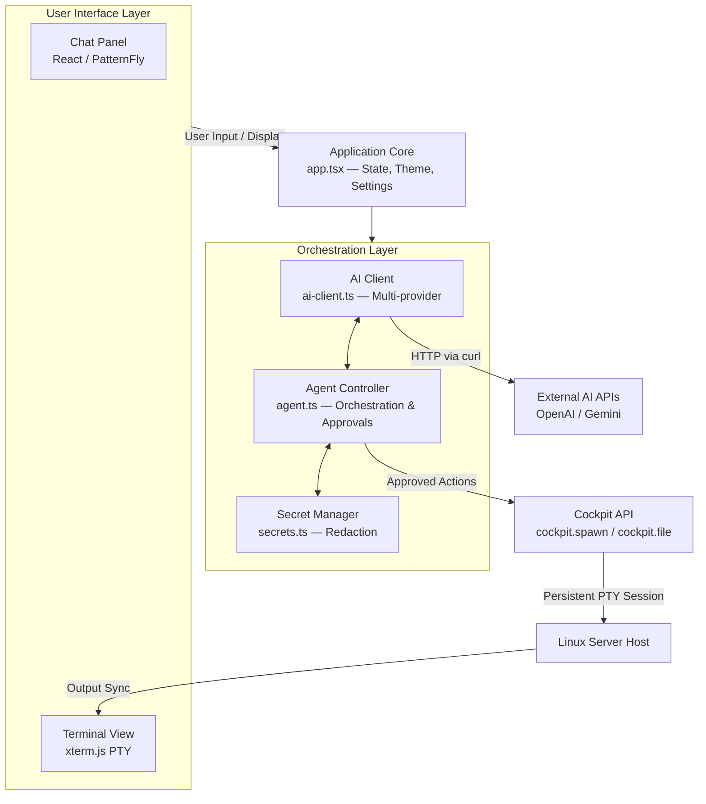

### An AI-powered terminal assistant plugin for [Cockpit](https://cockpit-project.org/), the web-based Linux server management interface.

[](https://cockpit-project.org/)
[](package.json)
[](LICENSE)
[](https://www.typescriptlang.org/)
[](https://react.dev/)
[](https://www.patternfly.org/)

[🇨🇳 **中文**](README.zh-CN.md) | 🌐 **English**

## Features

- 💻 **Interactive Browser Terminal** - Every Agent executed command is visible in a real-time terminal. You can watch, interact, or take over instantly (e.g., entering sudo passwords or stopping commands) to ensure you remain in control.
- 🤖 **BYOK AI Support** - Choose between top-tier models from OpenAI, Google Gemini, or compatible providers to suit your specific administration needs and budget.
- ⚡ **Autonomous Agentic Control** - Let the Agent handle complex workflows by executing sequences of commands, analyzing outputs, and iterating until your goal is seamlessly achieved.
- 🛡️ **Intelligent Safety Controls** - Execute commands with confidence using customizable risk-based safety modes that prevent accidental or malicious system changes.
- 🔒 **Automatic Secret Protection** - Keep your sensitive data secure with automatic, on-the-fly detection and redaction of passwords, API keys, and private tokens.
- 🛠️ **Utility Toolbar** - Access history, debug logs, and toggle light/dark mode instantly from the top-right toolbar.
  

## Screenshots & Demo

### 1. Dashboard & Quick Actions
The agent landing screen provides interactive shortcuts to get started instantly with standard server operations.


### 2. Autonomous Command Execution
A real-time, side-by-side view showing the Agent's thought process and actions, while syncing live outputs with a fully interactive terminal.


### 3. Demo
<a href="https://www.youtube.com/watch?v=t03g_AALki0" target="_blank">
  
</a>

## Installation

### ⚡ Quick Automatic Installation

No Node.js, npm, or compilation is required! Install the pre-compiled plugin directly onto your server with a single command. The installer automatically detects your privileges and targets the appropriate directory:

* **System-Wide Installation (Recommended - requires root/sudo)**:
  ```bash
  curl -sSL https://raw.githubusercontent.com/ShaoRou459/CockpitServerAI/master/install.sh | sudo bash
  ```
  *Targets `/usr/share/cockpit/cockpit-ai-agent` and configures standard system-wide permissions.*

* **User-Local Installation (Non-Root - installs for current user)**:
  ```bash
  curl -sSL https://raw.githubusercontent.com/ShaoRou459/CockpitServerAI/master/install.sh | bash
  ```
  *Targets your local user path `~/.local/share/cockpit/cockpit-ai-agent`.*

## Security & Privacy

Since this tool has direct access to your server, we've built in multiple layers of security and privacy protections:

### 🛡️ Local & Private AI Options
The entire system is BYOK, including support for local AI models (via Ollama's Openai format endpoint, etc.) ensuring that your server's data is secure.

### 🔒 Automatic Secret Redaction
Passwords, API keys, and tokens in command outputs are automatically replaced with placeholders (e.g., `SECRET_1`) before reaching the Agent. It can use these placeholders to write commands, and the system securely swaps the real secrets back in just before execution, ensuring credentials never leave your server.


### 🚦 Risk Levels & YOLO Mode
Every generated command is evaluated for risk before execution. Users can choose from multiple execution modes (Paranoid, Cautious, Moderate, YOLO, and Full YOLO) depending on their security preferences:


| Level | Examples | Default Behavior |
|-------|----------|------------------|
| 🟢 **Low** | `ls`, `cat`, `df`, `ps` | Auto-executed in YOLO mode |
| 🟡 **Medium** | `systemctl restart`, `apt install` | Always requires approval |
| 🔴 **High** | Config changes, user management | Always requires approval |
| ☠️ **Critical** | `rm -rf /`, disk formats, fork bombs | **Blocked entirely** by the internal Command Blocklist |


### 📝 Audit Logging
Every command executed by the Agent is logged, providing a clear paper trail of all system modifications.


## Configuration

1. Access Cockpit in your browser (usually `https://your-server:9090`)
2. Navigate to **Agent** in the sidebar
3. Click the ⚙️ settings button
4. Configure your AI provider:

| Provider | API Key Source | Notes |
|----------|---------------|-------|
| **OpenAI** | [platform.openai.com](https://platform.openai.com/api-keys) | Supports GPT-5.5, GPT-4.1, o3-mini, etc. |
| **Google Gemini** | [AI Studio](https://makersuite.google.com/app/apikey) | Supports Gemini 3.5 Flash, 3.1 Pro, etc. |
| **Custom** | Your provider | Any OpenAI/Gemini-compatible API |

### Settings Overview

The settings panel allows you to customize the agent's behavior, safety limits, and appearance:

| Setting Category | Description |
|------------------|-------------|
| **Provider & Models** | Set AI provider, API key, model, and custom Base URL (e.g., Ollama). |
| **Safety Mode** | AI autonomy level, from **Paranoid** (manual approval) to **Full YOLO** (auto-run). |
| **Resource Limits** | Max tokens, temperature, and max autonomous loop iterations per task. |
| **Output Truncation** | Max characters of terminal output sent to AI to prevent context overflow. |
| **Secret Redaction** | Auto-mask passwords and API keys in terminal output before sending to AI. |
| **Command Blocklist** | Custom list of destructive commands (e.g., `rm -rf /`) permanently blocked. |
| **Audit & Debug** | Toggle command logging and debug mode. |
| **UI Preferences** | Light/Dark theme and interface language. |

## Architecture



## 🛠️ Development & Source Setup

If you want to contribute, modify the code, or build the project from source, use the steps below:

### Prerequisites
- Cockpit installed on your Linux server
- Node.js 18+
- npm

### Build from Source
```bash
# Clone the repository
git clone https://github.com/ShaoRou459/CockpitServerAI.git
cd CockpitServerAI

# Install dependencies
npm install

# Build the plugin
npm run build

# Link for development (symlink to your user's local cockpit directory)
mkdir -p ~/.local/share/cockpit
ln -s $(pwd)/dist ~/.local/share/cockpit/cockpit-ai-agent

# Restart Cockpit or refresh your browser
```

### Watch Mode (Development)
```bash
npm run watch
```
This will automatically rebuild on file changes.

### Production Build
```bash
NODE_ENV=production npm run build
```

### Manual System-Wide Installation
If you want to build from source and manually copy the build to the system directory:
```bash
sudo cp -r dist /usr/share/cockpit/cockpit-ai-agent
```

## Project Structure

```
cockpit-ai-agent/
├── src/
│   ├── app.tsx                 # Main application component
│   ├── index.tsx               # Entry point
│   ├── app.scss                # Custom styles
│   ├── components/
│   │   ├── ChatPanel.tsx       # Chat interface
│   │   ├── TerminalView.tsx    # xterm.js terminal
│   │   ├── SettingsModal.tsx   # Configuration modal
│   │   └── ApprovalModal.tsx   # Command approval dialog
│   └── lib/
│       ├── ai-client.ts        # Multi-provider AI client
│       ├── agent.ts            # Agent controller
│       ├── settings.ts         # Settings management
│       └── types.ts            # TypeScript types
├── dist/                       # Built plugin (generated)
├── package.json
├── build.js                    # esbuild configuration
└── README.md
```


## Contributing

Contributions are welcome! Please feel free to submit a Pull Request.

## License

This project is licensed under the LGPL-2.1 License - see the [LICENSE](LICENSE) file for details.

## Acknowledgments

- [Cockpit Project](https://cockpit-project.org/) for the excellent server management platform
- [PatternFly](https://www.patternfly.org/) for the React component library
- [xterm.js](https://xtermjs.org/) for terminal emulation
- [Linux.Do](https://linux.do) for communal support and inspiration 
