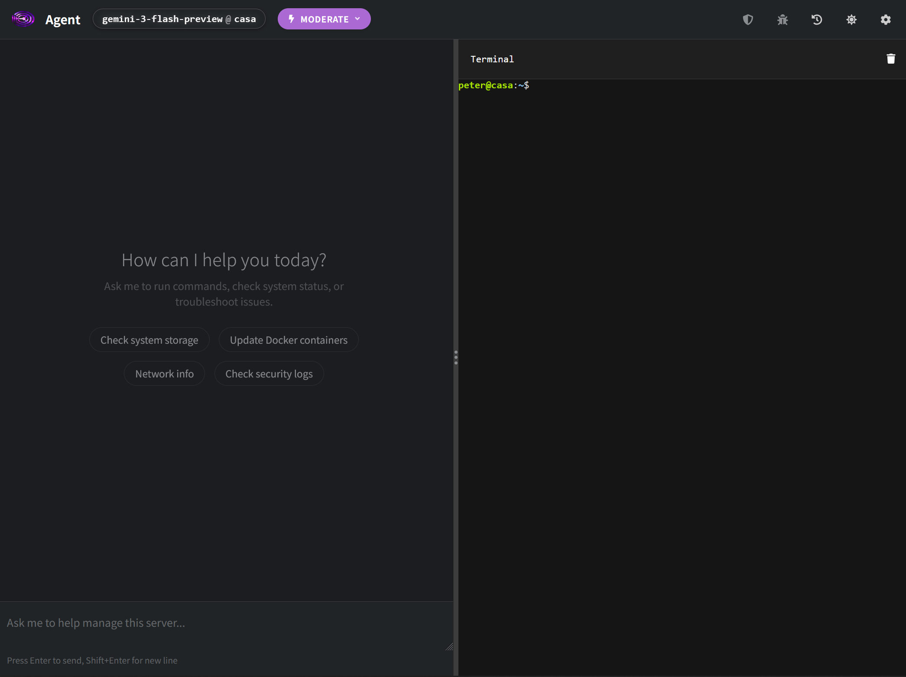
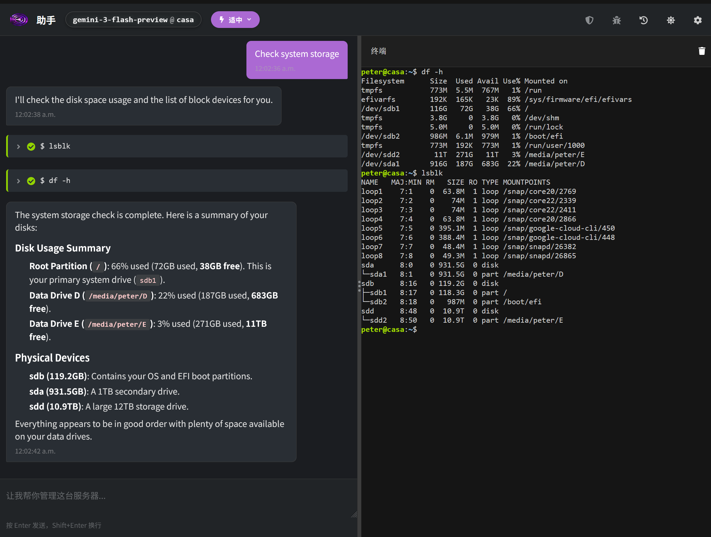

### An AI-powered terminal assistant plugin for [Cockpit](https://cockpit-project.org/), the web-based Linux server management interface.

[](https://cockpit-project.org/)
[](package.json)
[](LICENSE)
[](https://www.typescriptlang.org/)
[](https://react.dev/)
[](https://www.patternfly.org/)

---

## Features

- 🤖 **Multi-Provider AI Support** - Choose between top-tier models from OpenAI, Google Gemini, or compatible providers to suit your specific administration needs and budget.
- ⚡ **Autonomous Agentic Control** - Let the AI handle complex workflows by executing sequences of commands, analyzing outputs, and iterating until your goal is seamlessly achieved.
- 🛡️ **Intelligent Safety Controls** - Execute commands with confidence using customizable risk-based safety modes that prevent accidental or malicious system changes.
- 🔒 **Automatic Secret Protection** - Keep your sensitive data secure with automatic, on-the-fly detection and redaction of passwords, API keys, and private tokens.
- 💻 **Interactive Browser Terminal** - Interact directly with your server through a fully-featured terminal environment that natively supports interactive tools like vim, ssh, and sudo.

## Screenshots

### 1. Dashboard & Quick Actions
The agent landing screen provides interactive shortcuts to get started instantly with standard server operations.


### 2. Autonomous Command Execution
A real-time, side-by-side view showing the AI executing disk partition checks, parsing results, and formatting a clear storage summary—all while syncing live outputs with a fully interactive terminal.


## Installation

### Prerequisites

- Cockpit installed on your Linux server
- Node.js 18+ (for development)
- npm

### Development Setup

```bash
# Clone the repository
git clone https://github.com/your-username/cockpit-ai-agent.git
cd cockpit-ai-agent

# Install dependencies
npm install

# Build the plugin
npm run build

# Link for development (symlink to ~/.local/share/cockpit)
mkdir -p ~/.local/share/cockpit
ln -s $(pwd)/dist ~/.local/share/cockpit/cockpit-ai-agent

# Restart Cockpit or refresh your browser
```

### Watch Mode (Development)

```bash
npm run watch
```

This will automatically rebuild on file changes.

### Production Build

```bash
NODE_ENV=production npm run build
```

### System-Wide Installation

```bash
sudo cp -r dist /usr/share/cockpit/cockpit-ai-agent
```

## Security & Privacy

Since this tool has direct access to your server, we've built in multiple layers of security and privacy protections:

### 🛡️ Local & Private AI Options
You can configure the agent to use local AI models (via Ollama, vLLM, etc.) ensuring that your server's data never leaves your internal network.

### 🔒 Automatic Secret Redaction
The agent actively scans all command outputs and automatically redacts sensitive information on the fly. Passwords, API keys, and private tokens are replaced with referenceable placeholders (e.g., `<SECRET_1>`) before being sent to the AI provider. The AI can still write commands using these placeholders, and the agent will safely substitute the real secrets back in right before execution—meaning your credentials stay strictly local while the AI still gets the job done.

### 🚦 Risk Levels & YOLO Mode
Every generated command is evaluated for risk before execution:

| Level | Examples | Default Behavior |
|-------|----------|------------------|
| 🟢 **Low** | `ls`, `cat`, `df`, `ps` | Auto-executed in YOLO mode |
| 🟡 **Medium** | `systemctl restart`, `apt install` | Always requires approval |
| 🔴 **High** | Config changes, user management | Always requires approval |
| ☠️ **Critical** | `rm -rf /`, disk formats, fork bombs | **Blocked entirely** by the internal Command Blocklist |

By default, **all** commands require explicit user approval. You can optionally enable **YOLO Mode** in the settings to bypass approval for **Low** risk commands.

### 📝 Audit Logging
Every command executed by the agent is logged, providing a clear paper trail of all system modifications.

## Configuration

1. Access Cockpit in your browser (usually `https://your-server:9090`)
2. Navigate to **AI Agent** in the sidebar
3. Click the ⚙️ settings button
4. Configure your AI provider:

| Provider | API Key Source | Notes |
|----------|---------------|-------|
| **OpenAI** | [platform.openai.com](https://platform.openai.com/api-keys) | Supports GPT-4o, GPT-4-turbo, etc. |
| **Google Gemini** | [AI Studio](https://makersuite.google.com/app/apikey) | Supports Gemini 2.0, 1.5 Pro/Flash |
| **Custom** | Your provider | Any OpenAI-compatible API |

## Usage

### Basic Commands

Simply type what you want to do in natural language:

- "Check disk space usage"
- "Show me the last 50 lines of /var/log/syslog"
- "Restart nginx"
- "What services are failing?"
- "Install htop"

## Architecture

```
┌─────────────────────────────────────────┐
│          Cockpit Web Interface          │
├─────────────────────────────────────────┤
│  ┌─────────────┐  ┌─────────────────┐   │
│  │  Chat Panel │  │  Terminal View  │   │
│  │             │  │   (xterm.js)    │   │
│  └──────┬──────┘  └────────▲────────┘   │
│         │                  │            │
│  ┌──────▼──────────────────┴──────┐     │
│  │        Agent Controller        │     │
│  │  • AI Client (multi-provider)  │     │
│  │  • Command Parser              │     │
│  │  • Approval Manager            │     │
│  └───────────────┬────────────────┘     │
│                  │                      │
│  ┌───────────────▼────────────────┐     │
│  │      Cockpit API Layer         │     │
│  │  cockpit.spawn() / file()      │     │
│  └────────────────────────────────┘     │
└─────────────────────────────────────────┘
           │
           ▼
    ┌──────────────┐
    │ Linux Server │
    └──────────────┘
```

## Project Structure

```
cockpit-ai-agent/
├── src/
│   ├── app.tsx                 # Main application component
│   ├── index.tsx               # Entry point
│   ├── app.scss                # Custom styles
│   ├── components/
│   │   ├── ChatPanel.tsx       # Chat interface
│   │   ├── TerminalView.tsx    # xterm.js terminal
│   │   ├── SettingsModal.tsx   # Configuration modal
│   │   └── ApprovalModal.tsx   # Command approval dialog
│   └── lib/
│       ├── ai-client.ts        # Multi-provider AI client
│       ├── agent.ts            # Agent controller
│       ├── settings.ts         # Settings management
│       └── types.ts            # TypeScript types
├── dist/                       # Built plugin (generated)
├── package.json
├── build.js                    # esbuild configuration
└── README.md
```

## Supported AI Providers

### OpenAI
- Models: GPT-4o, GPT-4o-mini, GPT-4-turbo, GPT-3.5-turbo, o1-preview, o1-mini
- Endpoint: `https://api.openai.com/v1`

### Google Gemini
- Models: Gemini 2.0 Flash, Gemini 1.5 Pro, Gemini 1.5 Flash
- Endpoint: `https://generativelanguage.googleapis.com`

### Custom (OpenAI-Compatible)
- Works with: Ollama, vLLM, OpenRouter, Azure OpenAI, etc.
- Configure your own base URL and model name

## Contributing

Contributions are welcome! Please feel free to submit a Pull Request.

## License

This project is licensed under the LGPL-2.1 License - see the [LICENSE](LICENSE) file for details.

## Acknowledgments

- [Cockpit Project](https://cockpit-project.org/) for the excellent server management platform
- [PatternFly](https://www.patternfly.org/) for the React component library
- [xterm.js](https://xtermjs.org/) for terminal emulation
