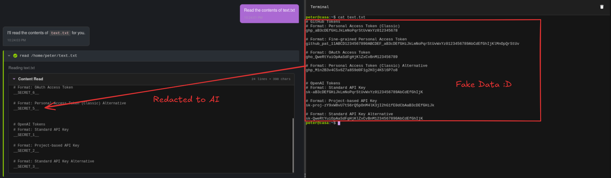
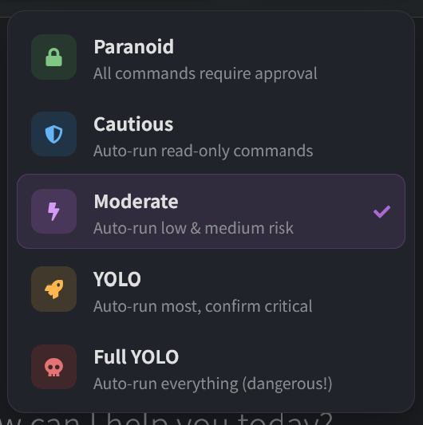
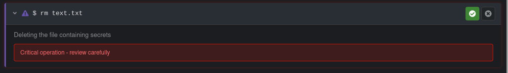
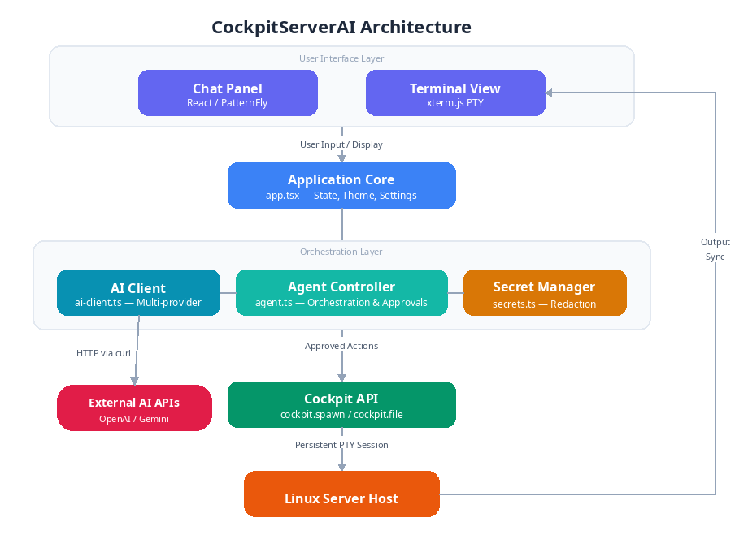

### 基于 AI 的 Cockpit 终端助手插件，用于 [Cockpit](https://cockpit-project.org/) Web 版 Linux 服务器管理界面。

[](https://cockpit-project.org/)
[](package.json)
[](LICENSE)
[](https://www.typescriptlang.org/)
[](https://react.dev/)
[](https://www.patternfly.org/)

[🌐 **English**](README.md) | 🇨🇳 **中文**

## 功能特色

- 🤖 **多提供商 AI 支持** - 在 OpenAI、Google Gemini 或兼容提供商之间选择顶级模型，满足您的管理需求和预算。
- 💻 **交互式浏览器终端** - AI 执行的命令在实时终端中完全可见。您可以随时观察、交互或立即接管控制（如输入 sudo 密码或终止命令），确保始终掌控全局。
- ⚡ **自主智能体控制** - 让 AI 处理复杂工作流：执行命令序列、分析输出并迭代，直到无缝达成目标。
- 🛡️ **智能安全控制** - 通过可自定义的基于风险的安全模式，放心执行命令，防止意外或恶意系统更改。
- 🔒 **自动秘密保护** - 自动实时检测并脱敏密码、API 密钥和私有令牌，确保敏感数据安全。

---

## 演示


https://github.com/user-attachments/assets/af7baa1a-23b7-4205-b454-8d88b15ba490


---

## 截图

### 1. 仪表盘与快捷操作
智能体首页提供交互式快捷方式，可快速开始标准服务器操作。


### 2. 自主命令执行
实时分屏视图展示 AI 执行磁盘分区检查、解析结果并格式化存储摘要——同时与完全交互式终端同步实时输出。


## 安装

### ⚡ 快速自动安装

无需 Node.js、npm 或编译！只需一条命令，即可直接将预编译好的插件安装到您的服务器上。安装脚本会自动检测您的用户权限，并选择合适的安装目录：

* **系统级安装（推荐 - 需要 root/sudo 权限）**：
  ```bash
  curl -sSL https://raw.githubusercontent.com/ShaoRou459/CockpitServerAI/master/install.sh | sudo bash
  ```
  *安装到 `/usr/share/cockpit/cockpit-ai-agent` 并配置文件系统权限。*

* **用户本地安装（非 root - 仅为当前用户安装）**：
  ```bash
  curl -sSL https://raw.githubusercontent.com/ShaoRou459/CockpitServerAI/master/install.sh | bash
  ```
  *安装到您的本地用户目录 `~/.local/share/cockpit/cockpit-ai-agent`。*

## 安全与隐私

由于此工具可直接访问您的服务器，我们内置了多层次的安全和隐私保护：

### 🛡️ 本地与私有 AI 选项
您可以配置智能体使用本地 AI 模型（通过 Ollama、vLLM 等），确保服务器数据永不离开您的内部网络。

### 🔒 自动秘密脱敏
命令输出中的密码和 API 密钥等敏感信息，在发送给 AI 前会自动替换为占位符（如 `<SECRET_1>`）。AI 仍可使用占位符编写命令，智能体在执行前会将其安全还原。这确保了您的凭据永远不会离开服务器。



### 🚦 风险等级与 YOLO 模式
每条生成的命令在执行前都会评估风险。用户可根据安全偏好选择多种执行模式（偏执、谨慎、中等、YOLO 和完全 YOLO）：



| 等级 | 示例 | 默认行为 |
|-------|----------|------------------|
| 🟢 **低** | `ls`, `cat`, `df`, `ps` | YOLO 模式下自动执行 |
| 🟡 **中** | `systemctl restart`, `apt install` | 始终需要批准 |
| 🔴 **高** | 配置修改、用户管理 | 始终需要批准 |
| ☠️ **严重** | `rm -rf /`、磁盘格式化、fork 炸弹 | **完全阻止**，由内部命令黑名单控制 |

默认情况下，**所有**命令都需要显式用户批准。您可以选择在设置中启用 **YOLO 模式**，以跳过对**低**风险命令的批准。



### 📝 审计日志
智能体执行的每条命令都会被记录，提供所有系统修改的清晰追踪记录。

## 配置

1. 在浏览器中访问 Cockpit（通常为 `https://your-server:9090`）
2. 在侧边栏导航至 **AI Agent**
3. 点击 ⚙️ 设置按钮
4. 配置您的 AI 提供商：

| 提供商 | API 密钥来源 | 备注 |
|----------|---------------|-------|
| **OpenAI** | [platform.openai.com](https://platform.openai.com/api-keys) | 支持 GPT-5.5、GPT-4o、o3-mini 等 |
| **Google Gemini** | [AI Studio](https://makersuite.google.com/app/apikey) | 支持 Gemini 3.5 Flash、3.1 Pro 等 |
| **自定义** | 您的提供商 | 任何兼容 OpenAI 的 API |

### 设置概览

设置面板允许您自定义智能体的行为、安全限制和外观：

| 设置类别 | 描述 |
|------------------|-------------|
| **提供商与模型** | 设置 AI 提供商、API 密钥、模型及自定义 Base URL（如 Ollama）。 |
| **安全模式** | AI 自主级别，从**偏执**（手动批准）到**完全 YOLO**（自动执行）。 |
| **资源限制** | 每次响应最大 Token 数、温度及最大自主循环次数。 |
| **输出截断** | 限制发送给 AI 的终端输出最大字符数，防上下文溢出。 |
| **秘密脱敏** | 发送给 AI 前，自动遮蔽终端输出中的密码和 API 密钥。 |
| **命令黑名单** | 永久阻止执行的破坏性命令自定义列表（如 `rm -rf /`）。 |
| **审计与调试** | 开启/关闭命令日志记录和调试模式。 |
| **界面偏好** | 切换亮色/暗色主题及界面语言。 |


## 架构



## 🛠️ 开发与源码设置

如果您想贡献代码、修改或从源码构建项目，请按以下步骤操作：

### 前提条件
- 在 Linux 服务器上安装 Cockpit
- Node.js 18+
- npm

### 从源码构建
```bash
# 克隆仓库
git clone https://github.com/ShaoRou459/CockpitServerAI.git
cd CockpitServerAI

# 安装依赖
npm install

# 构建插件
npm run build

# 链接用于开发（创建符号链接到用户本地 cockpit 目录）
mkdir -p ~/.local/share/cockpit
ln -s $(pwd)/dist ~/.local/share/cockpit/cockpit-ai-agent

# 重启 Cockpit 或刷新浏览器
```

### 监听模式（开发）
```bash
npm run watch
```
这将自动在文件更改时重新构建。

### 生产构建
```bash
NODE_ENV=production npm run build
```

### 手动系统级安装
如果您想从源码构建并手动将构建产物复制到系统目录：
```bash
sudo cp -r dist /usr/share/cockpit/cockpit-ai-agent
```

## 项目结构

```
cockpit-ai-agent/
├── src/
│   ├── app.tsx                 # 主应用组件
│   ├── index.tsx               # 入口文件
│   ├── app.scss                # 自定义样式
│   ├── components/
│   │   ├── ChatPanel.tsx       # 聊天界面
│   │   ├── TerminalView.tsx    # xterm.js 终端
│   │   ├── SettingsModal.tsx   # 配置弹窗
│   │   └── ApprovalModal.tsx   # 命令审批对话框
│   └── lib/
│       ├── ai-client.ts        # 多提供商 AI 客户端
│       ├── agent.ts            # 智能体控制器
│       ├── settings.ts         # 设置管理
│       └── types.ts            # TypeScript 类型定义
├── dist/                       # 构建产物（自动生成）
├── package.json
├── build.js                    # esbuild 配置
└── README.md
```

## 贡献

欢迎贡献！请随时提交 Pull Request。

## 许可

本项目基于 LGPL-2.1 许可证 - 详见 [LICENSE](LICENSE) 文件。

## 致谢

- [Cockpit Project](https://cockpit-project.org/) 提供的优秀服务器管理平台
- [PatternFly](https://www.patternfly.org/) 提供的 React 组件库
- [xterm.js](https://xtermjs.org/) 提供的终端模拟
- [Linux.do](https://linux.do) 社区及与帮助和构想！
